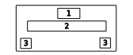

# Preguntas

Software que va permitir mostrar cuestionarios en base a archivos Json que representan las preguntas y las forma de solucionarlos. La primera version de esto es poder tener un software que permita reproducir n cantidad de preguntas guardar sus respuestas y evaluar el resultado del cuestionario. Mostrar al usuario las preguntas correctas y las que falló. Tener un sistema de puntuación que evaluara tiempo y cantidad de respuestas correctas. Para esto vamos a usar la librerira Arcade.
La idea inicial es que las respuestas sean opción multiple. el usuario va a tener *N* opciones y deberá elegir una de estas como la respuesta correcta. Responder las *N* preguntas que tenga el cuestionario y subirlo para su evaluación. finalmente se le mostrará el resultado de la prueba.

# Interfaz gráfica

En la parte superior de la pantalla vamos a tener las opciones para que el usuario las pueda arrastrar al lugar que corresponde a una respuesta.
En la parte central vamos a tener el texto o lugar donde poner las respuestas que el usuario seleccione. lsa opciones se van a arrastar hasta las casillas. En caso de soltar la respuesta fuera de una casilla esta volverá a su lugar de orgien.
En la parte inferior de la pantalla vamos a mostrar dos botoenes de navegación. Uno para avanzar y otro para poder volver entre el conjunto de preguntas. Si el usuario seleccionó alguna respuesta y cambia de pregunta el sistema debe guarda el estado de la pregunta con las respuesta elegida por el usuario.

# Representación de cuestionarios
Se usa un Json para la reperesentación de un cuestionario. La estructura para la version 1.0 tiene dos claves:
## Nombre Cuestionario
Representa el nombre del cuestionario. Es una cadena y puede tener cualquier valor.
## Preguntas
Es una lista de nodos. Cada uno de los nodos representa una pregunta del cuestionario. pueden haber tantas preguntas como se quieran incluir en el cuestionario.

El nodo contiene las siguientes calves:
### Pregunta
Esta clave es la pregunta a la cual el usuario debera responder.
### Opciones
Es una lista de valores. Contiene las opciones entre las cuales el usuario debera elegir como posible respuesta.
### Correcta
Lista que respresenta los valores correctos. *Se podría usar los indices que representa la opción correcta pero al momento de construir el custionario hace que sea menos claro cual es la opción u opciones correcta*, por esto se usa la palabra.

# Sistema de evaluación

